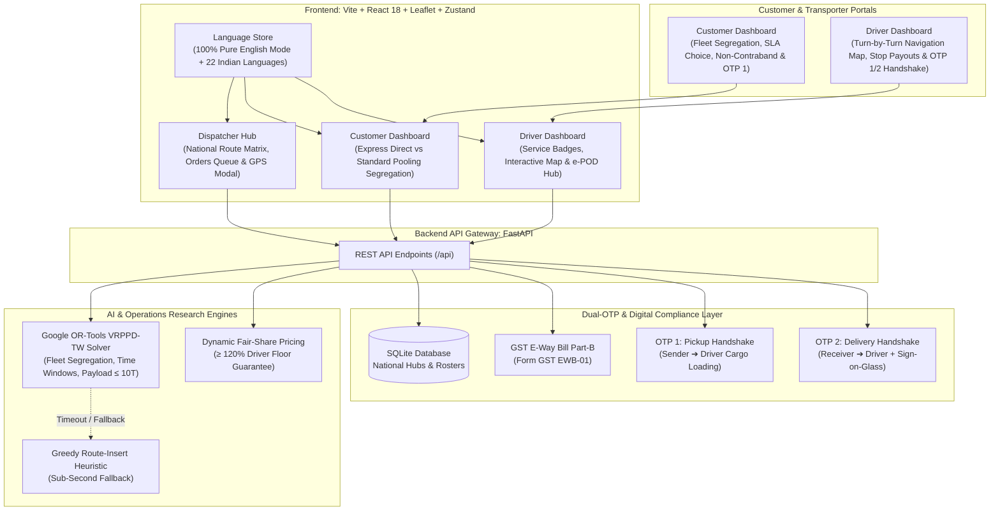

# LastMileSaathi (Route Matrix) — Pan-India Enterprise Edition
### AI-Optimized Freight Consolidation & National Freight Corridors (Golden Quadrilateral)

LastMileSaathi is a full-stack, AI-powered operations research freight consolidation platform tailored for primary high-volume national freight corridors across India:
- **Delhi NCR ➔ Mumbai (via Jaipur & Ahmedabad on NH-48)**
- **Mumbai ➔ Bengaluru (via Pune on NH-48)**
- **Bengaluru ➔ Chennai (via Hosur on National Expressways)**
- **Kolkata ➔ Delhi NCR (via Varanasi, Kanpur & Lucknow on NH-19)**
- **Hyderabad ➔ Bengaluru (on NH-44)**
- **Ahmedabad ➔ Pune / Surat**

---

## 1. System Architecture Diagram



---

## 2. High-Volume National Freight Corridors

### 1. 🛣️ Primary Default Demo Trip & Multi-Stop Consolidation
- **Active Trip**: 10-Tonne MCV (`DL-01-GB-4592`) running **Delhi NCR ➔ Mumbai** with 6.0T baseline load (4.0T spare capacity).
- **Consignment X**: **Delhi NCR ➔ Ahmedabad** (2.0 Tonnes - Precision Machine Components & Auto Spares).
- **Consignment Y**: **Ahmedabad ➔ Mumbai** (1.5 Tonnes - Premium Denim & Organic Cotton Textiles).
- **Live Driver GPS**: Near Jaipur / Ajmer on NH-48 (`26.9124° N, 75.7873° E`).
- **Additional Active Corridors**:
  - **Bengaluru ➔ Hyderabad**: Electronic Components & High-Density Cloud Servers (3.0 Tonnes).
  - **Kolkata ➔ Varanasi**: Industrial Jute Goods & FMCG Packets (2.5 Tonnes).
  - **Mumbai ➔ Pune**: Automotive Transmission Assemblies (1.2 Tonnes, Express).
  - **Bengaluru ➔ Chennai**: Precision Aerospace & Defense Tooling (2.0 Tonnes, Express).

---

## 3. Single-Command Launch

- **Windows 1-Click**: Double click `start_all.bat`
- **Command Line**:
  ```bash
  backend\venv\Scripts\python.exe run_all.py
  ```

### Active Endpoints:
- **Frontend App**: [http://localhost:5173](http://localhost:5173)
- **FastAPI Swagger API Docs**: [http://127.0.0.1:8000/docs](http://127.0.0.1:8000/docs)
- **API Health Check**: [http://127.0.0.1:8000/](http://127.0.0.1:8000/)